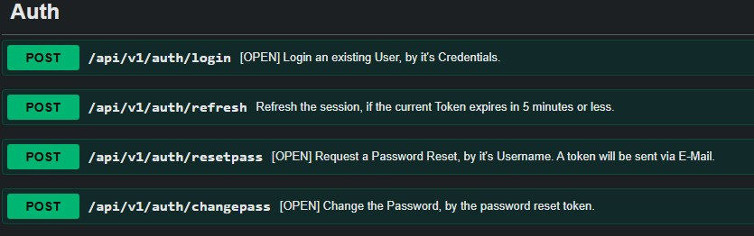
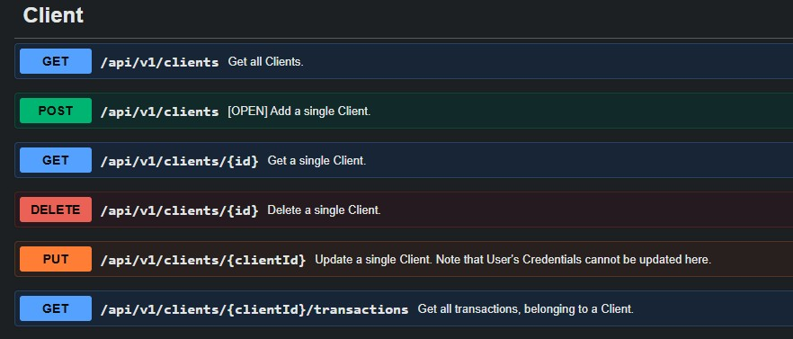
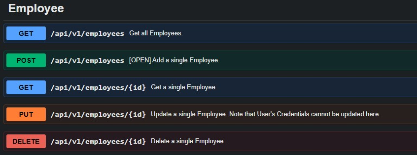
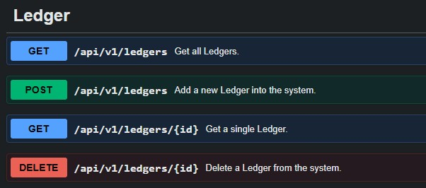
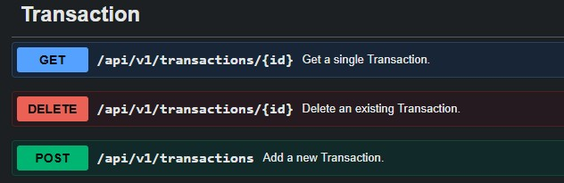
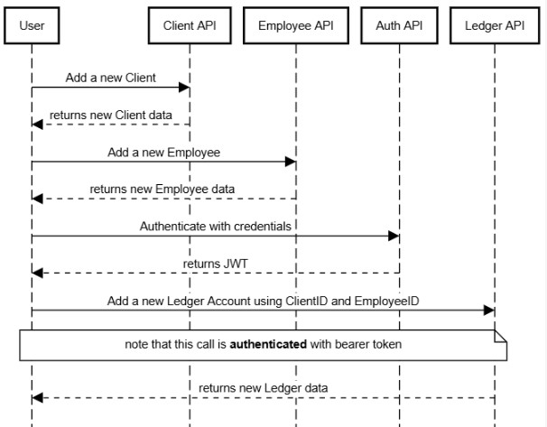

# MyLedgerApp – Ledger Management System (.NET & Messaging Architecture)

## Overview
This project is a backend application built in **C# (.NET)** to demonstrate
real-world backend engineering skills, including API design, event-driven
architecture, and cloud messaging.

The goal of this repository is not only to deliver functionality, but to
showcase **architectural thinking, production readiness, and best practices**
expected in professional backend teams.

---

## Problem Statement

This application aims to keep track of any User's cash balance in a clear and organized way. 
Bank apps don’t always cover everything, and spreadsheets can be 
confusing or error-prone. There’s a need for a simple app where users can record 
deposits and withdrawals, receive notifications, automatically see their current balance, 
and review their transaction history without dealing with complex tools.

---

## Architecture Overview

### High-Level Architecture

The LedgerApp is structured using a multi-layered architecture to ensure clear separation 
of concerns, maintainability, and scalability. Each layer has a specific responsibility 
and communicates only with adjacent layers.

The system is composed of:

- API layer
- Application / domain layer
- Infrastructure layer
- Messaging (Event-driven)

#### API Layer
The API layer is the entry point to the system. Its responsibilities:

> Expose HTTP endpoints

> Validate incoming requests

> Convert requests into application commands

> Return responses to clients

#### Application / Domain Layer

This is the core of the system. It contains Business rules, 
Domain models (e.g., Ledger, Transaction), Use cases (e.g., Deposit, Withdrawal). 
This layer does not depend on databases or messaging systems.
Responsibilities are:

> Business logic

> Calculate balances

> Coordinate operations

> Trigger domain events

#### Infrastructure Layer

This layer handles all persistance concerns (Database) such as:

> Database configuration & access

> Database modeling

> Repository implementations

#### Messaging (Events)
The Messaging component is an independent, decoupled service responsible for
handling asynchronous communication. It integrates with Azure Service Bus & 
Azure Email Communication Services. It's responsibilities:

> Listen/Produce messages from/to Azure Service Bus

> Send email notifications through Azure Email

> Handle cross-system communication

### Solution Components and Layers
The components in this solution are organized in a decoupled structure that aims to
separate responsabilities but also provide full interaction.
Below there is a diagram showing how this is delivered.

**Host** is where all components are defined, including DI and app's properties.

**MyLedgerApp** contains the API and Infrastructure Layer.

**Messaging** provides Event-Driven services

**Shared** hold elements that are commonly shared between all components.

---

### Architectural Decisions

- Layered architecture: Keeps things organized. API handles requests, Domain contains business rules, Infrastructure manages technical stuff. Makes the app easier to maintain and test.

- Event-driven (Messaging): Lets the app handle emails and notifications without slowing down core logic. Components are decoupled and scalable.

- Azure Service Bus: Reliable cloud messaging. Ensures messages are delivered even if the Messaging service is temporarily down.

**Trade-offs:**

Pros: Clear structure, scalable, maintainable, fault-tolerant.

Cons: More setup, extra components, slightly higher latency for async operations.

---

## Technology Stack

- **.NET / ASP.NET Core**
- **Database** (SQL Server / SqlLite)
- **ORM** (Entity Framework Core)
- **Azure Service Bus**
- **Testing** (xUnit / Moq)
- **Validation** (FluentValidations)

This tech decision is meant to deliver good compatibility and performance.

---

## API Design

### Endpoints
This application provides 5 API endpoints collections: Auth, Client, Employee, Ledger and Transaction.
Below you can see each one of them:

- <b>RESTful conventions</b>

-> The action is expressed by the HTTP method, not the URL.

-> Follow a consistent, hierarchical pattern in URL structure.

-> The response code must accurately reflect what happened with HTTP Status Codes.

-> Always versioning the API to evolve it without breaking consumers.

-> Naming Conventions (plural noums, lowercase, etc).

- <b>HTTP status codes</b>

-> Success Scenario

> GET: 200 OK

> POST: 201 Created

> PUT: 200 OK 

> DELETE: 204 No Content

-> Errors

> Wrong Validations or Bad Argument: 400 Bad Request

> No Authorization: 401 Unauthorized

> No Resource: 404 Not Found

> Invalid or wrong rule: 403 Forbidden

> Unexpected: 500 Internal Server Error

### API Documentation
- Swagger/OpenAPI is available at: `<baseUrl>/swagger/index.html`
- In <i>Development</i> mode, the swagger page will open automatically

#### Example Use Case: Client, Employee and Ledger Registration

In this next Sequence Diagram, it is shown a Use Case of a Client, Employee and Ledger registration.

User->Client API:Add a new Client
User<--Client API:returns new Client data

User->Employee API:Add a new Employee
User<--Employee API:returns new Employee data 

User->Auth API:Authenticate with credentials
User<--Auth API:returns JWT

User->Ledger API:Add a new Ledger Account using ClientID and EmployeeID
note over User,Ledger API: note that this call is **authenticated** with bearer token
User<--Ledger API:returns new Ledger data

---

## Database Design

### Data Model
//todo!