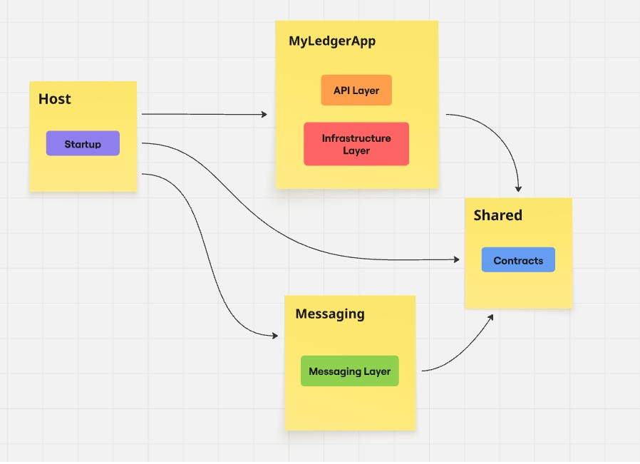

# MyLedgerApp – Ledger Management System (.NET & Messaging Architecture)

## Overview
This project is a backend application built in **C# (.NET)** to demonstrate
real-world backend engineering skills, including API design, event-driven
architecture, and cloud messaging.

The goal of this repository is not only to deliver functionality, but to
showcase **architectural thinking, production readiness, and best practices**
expected in professional backend teams.

---

## Problem Statement

This application aims to keep track of any User's cash balance in a clear and organized way. 
Bank apps don’t always cover everything, and spreadsheets can be 
confusing or error-prone. There’s a need for a simple app where users can record 
deposits and withdrawals, receive notifications, automatically see their current balance, 
and review their transaction history without dealing with complex tools.

---

## Architecture Overview

### High-Level Architecture

The LedgerApp is structured using a multi-layered architecture to ensure clear separation 
of concerns, maintainability, and scalability. Each layer has a specific responsibility 
and communicates only with adjacent layers.

The system is composed of:

- API layer
- Application / domain layer
- Infrastructure layer
- Messaging (Event-driven)

#### API Layer
The API layer is the entry point to the system. Its responsibilities:

> Expose HTTP endpoints

> Validate incoming requests

> Convert requests into application commands

> Return responses to clients

#### Application / Domain Layer

This is the core of the system. It contains Business rules, 
Domain models (e.g., Ledger, Transaction), Use cases (e.g., Deposit, Withdrawal). 
This layer does not depend on databases or messaging systems.
Responsibilities are:

> Business logic

> Calculate balances

> Coordinate operations

> Trigger domain events

#### Infrastructure Layer

This layer handles all persistance concerns (Database) such as:

> Database configuration & access

> Database modeling

> Repository implementations

#### Messaging (Events)
The Messaging component is an independent, decoupled service responsible for
handling asynchronous communication. It integrates with Azure Service Bus & 
Azure Email Communication Services. It's responsibilities:

> Listen/Produce messages from/to Azure Service Bus

> Send email notifications through Azure Email

> Handle cross-system communication


### Solution Components and Layers
The components in this solution are organized in a decoupled structure that aims to
separate responsabilities but also provide full interaction.
Below there is a diagram showing how this is delivered.



**Host** is where all components are defined, including DI and app's properties.

**MyLedgerApp** contains the API and Infrastructure Layer.

**Messaging** provides Event-Driven services

**Shared** hold elements that are commonly shared between all components.


---

### Architectural Decisions

- Layered architecture: Keeps things organized. API handles requests, Domain contains business rules, Infrastructure manages technical stuff. Makes the app easier to maintain and test.

- Event-driven (Messaging): Lets the app handle emails and notifications without slowing down core logic. Components are decoupled and scalable.

- Azure Service Bus: Reliable cloud messaging. Ensures messages are delivered even if the Messaging service is temporarily down.

**Trade-offs:**

Pros: Clear structure, scalable, maintainable, fault-tolerant.

Cons: More setup, extra components, slightly higher latency for async operations.

---

## Technology Stack

- **.NET / ASP.NET Core**
- **Database** (SQL Server / SqlLite)
- **ORM** (Entity Framework Core)
- **Azure Service Bus**
- **Testing** (xUnit / Moq)
- **Validation** (FluentValidations)

This tech decision is meant to deliver good compatibility and performance.

---

## API Design

### Endpoints
Describe the main API endpoints and their responsibilities.

- RESTful conventions
- HTTP status codes
- Validation strategy

### API Documentation
- Swagger/OpenAPI is available at: `/swagger`
- Example requests and responses

---

## Database Design

### Data Model
Explain the role of the database in the system.

- What kind of data is stored?
- Is it transactional, read-optimized, or both?

(Optional but recommended)
- Add a simplified database diagram here

[ Table A ] 1---* [ Table B ]


### Design Considerations
- Constraints and indexes
- Consistency guarantees
- How the DB supports event-driven workflows (e.g. outbox, idempotency)

---

## Event-Driven Architecture

### Messaging Flow
Explain how events are produced and consumed.

- What events are published?
- When are they published?
- Who consumes them?

### Reliability & Consistency
Describe how the system handles:
- Retries
- Failures
- Duplicate messages
- Dead-letter scenarios

---

## Error Handling & Resilience

- Global exception handling
- Retry policies
- Graceful degradation

Explain how failures are handled without crashing the system.

---

## Logging & Observability

- Structured logging
- Correlation IDs
- Log levels usage

(Optional)
- How this would integrate with Application Insights or similar tools

---

## Security Considerations

- Authentication / authorization approach
- Secure configuration management
- Input validation

Explain what is implemented and what is intentionally simplified.

---

## Testing Strategy

### Unit Tests
- What layers are tested?
- What is mocked?
- What kind of scenarios are covered?

### Testing Philosophy
Explain *what you chose not to test* and why.

---

## Local Development

### Prerequisites
- .NET SDK
- Docker (optional)
- Azure Service Bus emulator or configuration

### Running the Application

```bash
dotnet restore
dotnet build
dotnet run
```

## CI / Automation

Continuous Integration pipeline

Build & test steps

Code quality checks

Explain what runs automatically and why.

## Trade-offs & Limitations

Be honest here. This section is gold for recruiters.

What shortcuts were taken?

What would you improve in a real production system?

What was intentionally left out?

## Possible Improvements

Examples:

Caching

API versioning

Better observability

Performance optimizations

Security hardening

## What This Project Demonstrates

Summarize your skills clearly:

Backend API design

Event-driven systems

Cloud messaging

Clean architecture

Testing & automation

Production-oriented thinking

## Author

Your name
LinkedIn / GitHub / Portfolio link